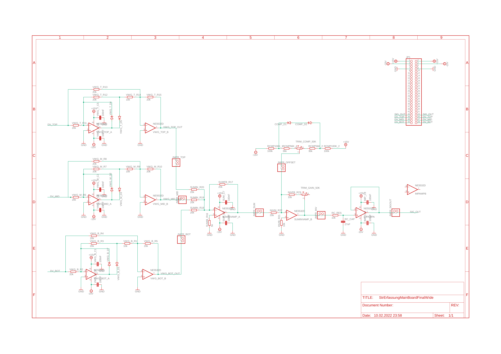
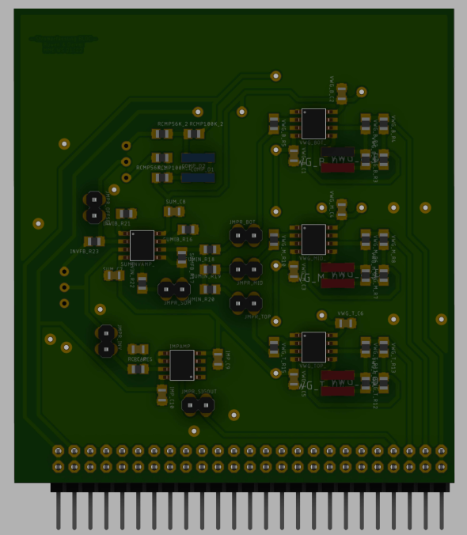

# P-Stromerfassung-Kettensaege
Projektarbeit: Schaltungstechnik Master Mechatronik
- Aufgabenstellung:
  Messung des Dreiphasenstrom eines BLDC-Motors in einer Kettensäge

- Genutzte Technologien:
  -   LTSpice (Simulation)
  -   Eagle (Platinendesign & Layout)
  -   Reflow Ofen & Löteisen (Bestückung)

# Schematic

# PCB

